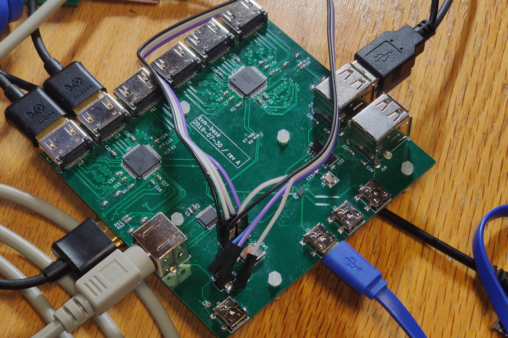
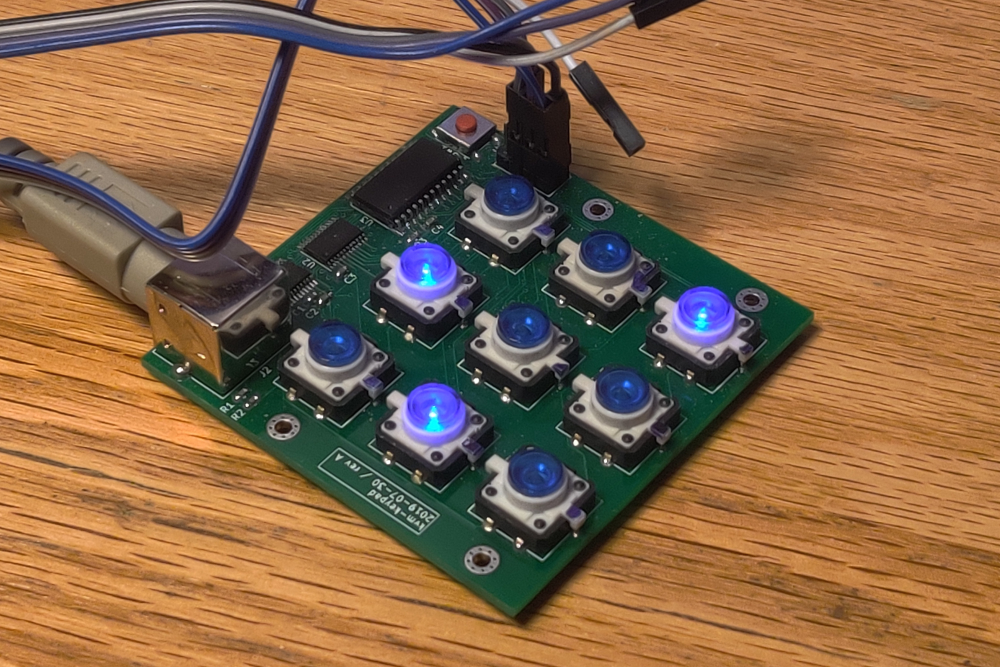

# kvm
> This is still a work in progress!

An open-source HDMI Keyboard/Video/Mouse (KVM) switch, which lets you switch two monitors and four USB devices between up to three computers.

Theoretically, it should support HDMI 1.3a and up to 1920 x 1200 resolution. Anecdotally, it has been tested up to 2560 x 1440 at 75 Hz and it seems to work. I currently don't have the equipment to measure the signal quality or anything like that, and don't have a monitor with a higher resolution, so I don't know how far it can be pushed.

The base has a total of six HDMI inputs (three computers with two monitors each) and two HDMI outputs (for the two monitors). It also has four mini-USB ports (three computers and one for power), four USB host ports (to connect a mouse, keyboard, and anything else), and a connector that goes to the keypad.

The keypad has a 3x3 grid of buttons. Pressing the buttons lets you switch monitor 1, monitor 2, and the USB ports between the three computers. It connects to the base via a cable, and receives power over that connection.

A [PS/2 connector](https://en.wikipedia.org/wiki/PS/2_port) and cable is used between the base and keypad. **Importantly, neither device actually speaks the PS/2 protocol!** PS/2 was just chosen because connectors and cables are readily available. You should not connect either device to anything else with a PS/2 port, or any sort of PS/2 adapter. (you most likely won't break anything, but it definitely won't work)

The source code/files are split up over several different repositories:
* [kvm-base](https://github.com/thatoddmailbox/kvm-base) - The main switch, with all input/output ports, and a connector that goes to the keypad.
* [kvm-keypad](https://github.com/thatoddmailbox/kvm-keypad) - The keypad, used to select the state of the various switches. Connected to the base.
* [kvm-fw](https://github.com/thatoddmailbox/kvm-fw) - The firmware that runs on both the base and the keypad.

## Building one
(still a work in progress)

Note that, currently, there are some [known issues](https://github.com/thatoddmailbox/kvm-base#known-issues) with the design.

* Order and assemble PCBs for the base and keypad. The respective repositories have manufacturing files that you can use. For the base in particular, it's very important to use the correct impedance-controlled stackup. See the base's README for details.
* Follow the instructions in the kvm-fw respository to program the base and the keypad. You will need at least one ST-LINK adapter.
	* If you want to debug the firmware, it will be helpful to have one or two USB to UART adapters and a second ST-LINK.
* You will also need a PS/2 cable to connect the base and keypad together, and HDMI and mini-USB cables to connect to the various ports on the base.
* For the base, it's also recommended to get five M2 standoffs, which you can place in the mounting holes.